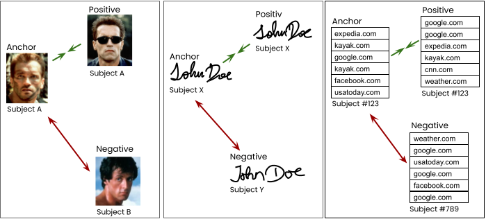
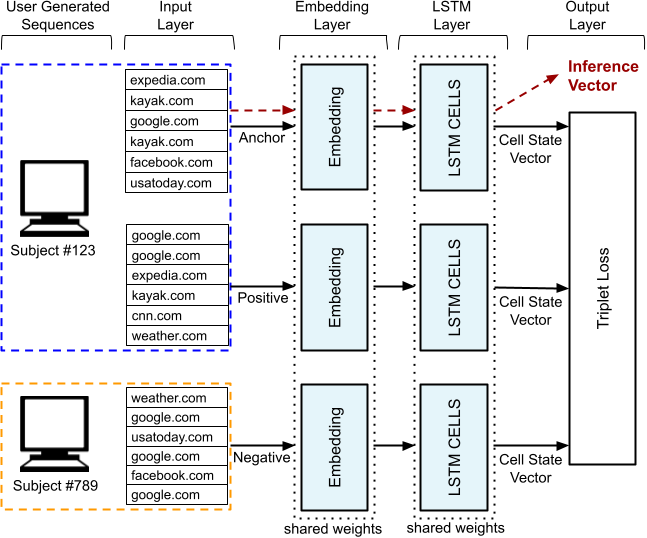

# tl_rnn

TL-RNN model: Triplet Loss Recurrent Neural Network

Copyright (C) Stefan Vamosi - All Rights Reserved

Unauthorized copying of this file, via any medium is strictly prohibited

Proprietary and confidential

Written by Stefan Vamosi <stefan@vamosi.org>, September 2021.

**LITERATURE REFERENCE**

Results generated with this model was recently published by: Stefan Vamosi, Thomas Reutterer and Michael Platzer; A deep recurrent neural network approach to learn sequence similarities for user-identification; Decision Support Systems; https://doi.org/10.1016/j.dss.2021.113718

**ABOUT TL-RNN**

The TL-RNN code package represents a generic deep neural-network-based framework for quantifying the similarity of ordered sequences in event histories. It combines an LSTM network layer with a triplet loss cost function used for network training. It yields an embedding space that serves as a similarity metric for complex sequential data, can handle multivariate sequential data and incorporate covariates. In this embedding space not only distances between sequences can be measured, but also structural approaches, like clusters could be applied.

<figure><figcaption>The motivation behind the TL-RNN: From image similarity to sequence similarity. Sequential user behavior is like a signature, characteristic patterns distinguish individuals from each other. Taken from (Vamosi, Reutterer, Platzer)</figcaption></figure>\

In contrast to approaches that rely on hand-engineered similarity metrics, TL-RNN allows to derive: (i) a purely data-driven sequence similarity metric based on subject-level characteristics, (ii) automatically associating co-occurring events within a sequence (network embedding layer), and (iii) to effectively incorporate any number of covariates for such similarity. Potentially, the model is able to consider all sorts of sequential characteristics, that is specifically: frequency, order, number of events, and co-/occuring event signals.

The triplet loss is based on the idea, that similarity should be learned from co-occurring patterns within a users' history. It is a way to contrast individuals with each other, in order to learn their specific similarities and differences. The triplet learning procedure, in the case of sequences with TL-RNN, is visualized in the following image: 

<figure><figcaption>Triplet comparison: Draw two sequences from the same user and a sequence from a different user. Taken from (Vamosi, Reutterer, Platzer)</figcaption></figure>

**MODEL ARCHITECTURE**

The model consists of an Embedding layer, an LSTM layer trained on a triplet loss function:

<figure><figcaption>Triplet comparison: Draw two sequences from the same user and a sequence from a different user. Taken from (Vamosi, Reutterer, Platzer)</figcaption></figure>

The model weights are shared across the three channels (anchor, positive and negative). After training, a sequence can be translated into an cell state vector (embedding vector), which coordinates reflect its sequential properties.

The number of dimension of the embedding space object is equal to the number of LSTM cells. The number of cells represents the capacity of the model and should correspond to the complexity and the amount of data (bias variance trade-off). Although high capacities tend to overfit in general, I suggest to choose a sufficiently large number of weights in order to receive precise comparisons between sequences. For clustering tasks the number of dimensions should be limited to an feasable amount probably. The risk of overfitting is relaxed by the validation loss monitor that is by default used in the training procedure. It looks on a validation split sampled from the training data (not test data-set). For the original publication, the number of cells was set to 512, which is very high. Consider, that the total number of weights increase non-linearly with the number of cells (fully-connected network).

However, the Embedding layer is important to reduce the input vector from a one-hot-encoding with the number of components equal to the cardinality of the input variable, to a much lower dimensional real valued vector. Also, the embedding layer is able to capture associations between similar events. E.g., in a customer retail context the events "purchase at BP" and "purchase at Shell" would share strong associations with each other, due to their interchangeability and common appearance within a sequence. Hence, these events would be close inside the Embedding space layer. Please do not confuse this Embedding layer embedding with the embedding ability of the TL-RNN as a whole (event embedding vs. sequence embedding).

The model can be used to re-identify, embedd or cluster all sorts of sequential data, like behavioral event data (shopping paths, browsing behavior, geographic paths, etc.).

**TRAINING AND PARAMETERIZATION**

The model has to be trained on a training data-set that consists of sequential data from individuals. For each user several sequences should be available, but not necessarily for all of them. 

Most of the parameters for training and inference is parameterized in the *config.py*:

*OPTIMIZER*: Defines the optimizer (usually Adam) and the learning rate [STRING]

*EPOCHS*: Defines the maximum number of epochs trained. If validation loss does not mimprove for patience -> then stop training before. [INT]

*SEQUENCE_LEN_MAX*: Maximal sequence length to encode. Longer sequences available will be cut-off either from the first or the last actions depending on . [INT]

*TAKE_LAST_ACTIONS*: If TAKE_LAST_ACTIONS = True -> take the SEQUENCE_LEN_MAX last observations and throw away the first observations. [BOOL]

*PATIENCE*: Patience defines the number of epochs that have to improve val-loss before early stopping is taking place [INT] 

*BATCHES_PER_USER*: Defines how many triplets are sampled per user (proper anchor user) [INT]

*BATCH_SIZE* = 64: Defines how many samples (triplets) are considered for one back-propagation calculation [INT]

*MAX_CARDINALITY*: Maximal cardinality for a feature (covariate), should be limited to hardware/model size. Consider that very rare signals do not play a big role [INT]

*VALID_SPLIT*: How much of the training data should be used for epoch validation (early stopping) [REAL]

*MODEL_PATH*: File path to the trained models / model weights [STRING]

*TENSORBOARD_PATH*: File path to the tensorboard files [STRING]

*COVARIATES_ALL*: Provide column names to consider as features (covariates) [LIST OF STRINGS]

*COVARIATES_TO_TRANSLATE*: Provide column names that are not integer encoded -> will provide rank-based encoding for these columns. [LIST OF STRINGS]

Some parameters have to be provided in the run.py or run.ipynb:

*alpha*: seperation (push-pull) strength between anchor-positive and anchor-negative distances. Start with 1.0 and increase until you are happy -> Bias-Variance Tradeoff. [REAL]

Constructor for dataprep class requires two parameters (beside the dataframe):

*user_ID*: Name of the user_ID column in the dataframe. [STRING]
*sequence_ID*: Name of the sequence_ID column to form sequences. [STRING]

There, the static hyperparameters of the model are set (Not the alpha value that defines the push-pull relation of the triplet loss. This has to be tuned during training). Each user that has at least two existing sequences is used BATCHES_PER_USER x BATCH_SIZE times as an anchor user. In each iteration, a negative sample from another user is drawn randomly to build the triplet. All users are canditates as negatives.

A project example is being provided and sequential data is being provided as sequential_data.csv. The data set provides time-series events of different individuals with different sequences each. Three different event types (covariates) were observed to each event.

user_ID | sequence_ID | eventData_1 | eventData_2 | eventData_3

The dimensions in detail:

user_ID: unique user ID

sequence_ID: running sequence_ID per user_ID, indicates which events belong to the same sequence (a user has several sequences
usually). This choice is usually arbitrary, but must be defined beforehand. You can either define it with a fixed time frame (day, week, month) or with a fixed number of events per sequence, the model only needs the sequence_ID and nothing else.

eventData_X -> categorical event data, if not already integer encoded, write it into *COVARIATES_TO_TRANSLATE* in *config.py*. Then, a rank-based integer encoding takes place, translating the most common event type as "1" with rarer events upwards. If the cardinality of a variable exceeds the *MAX_CARDINALITY* parameter in *config.py* then the rare events are put into a bin (others).

A fully commented example as a jupyter notebook and also as a .py is prepared for training and inference: run.py (python script) and run.ipynb (jupyter notebook). I highly recommend to take the jupyter notebook and run it step-wise for a better understanding.

The sequential data set is placed in the data-folder. Additionally, the data is already split into training and test data set. 

*******************************************************MOST IMPORTANT MODEL PARAMETERS**********************************************************************

******************************************************Hardware and Software requirements******************************************************************

Make sure you have Python, Keras and Tensorflow running on your environment. For this repository the following software stack was used (use the same to be on the safe side for compatibality. An upgrad to tensorflow 2.X might require some software changes):

Python 3.7 
Keras 2.1.6
Tensorflow 1.15
CUDA 10.0

GPU: NVIDIA TITAN V 12GB

If you want to run it on a CPU (approx. 5x slower) do not forget to change the LSTM layer in the model.py file accordingly: "CuDNNLSTM" to "LSTM"

