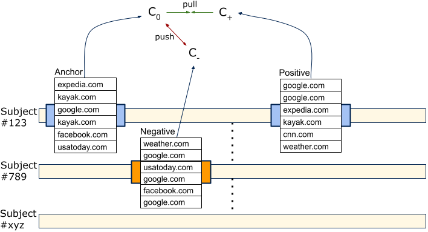

# tl_rnn
TL-RNN model: Triplet Loss Recurrent Neural Network

Copyright (C) Stefan Vamosi - All Rights Reserved
Unauthorized copying of this file, via any medium is strictly prohibited
Proprietary and confidential
Written by Stefan Vamosi <stefan@vamosi.org>, September 2021

This is a sequence similarity model. It is able to learn similarities between sequences,
purely based on the data itself, without applying arbitrary assumptions. Once the model
is trained, it is able to translate an input sequence into a vector. This embedding space
representation reflects the property of the sequence and the distance to other sequences
reflects their commonalities. 

Under the hood the model consists of an Embedding layer and an LSTM layer trained on a triplet
loss, which is a way to contrast individuals to learn their specific similarities and differences. The triplet learning in the case of sequences is visualized in the following image: 

<figure><figcaption>Triplet comparison: Draw two sequences from the same user and a sequence from a different user. (Vamosi, Reutterer, Platzer)</figcaption></figure>

This way, the model learns what is similar inside the same user
and what differentiate a user from others. This way it can cover frequencies, time-dependancies
and the order information.

This can be used to re-identify users, based on behavioral data, or to cluster (segment)
time-series data.

The project is written for categorical input data of the following form:

user_ID     sequence_ID     eventData_1     eventData_2     eventData_3

user_ID -> self-explanatory

sequence_ID -> indicates which events belong to the same sequence (a user has several sequences
usually)

eventData_X -> categorical event data, if not already integer encoded, write it into 
COVARIATES_TO_TRANSLATE in config.py

You can see an example run in the run.py, which is considering the attached sequential data

There, a holdout is created and evaluated in an re-identification task on triplets 

Hardware and Software requirements

Make sure you have Python, Keras and Tensorflow running. The project was developed on:

Python 3.7 
Tensorflow 1.5.0

Hardware-wise a GPU was used: CUDA for NVIDIA (TITAN V 12 GB)

If you want to train on CPU, make sure to change "CuDNNLSTM" into "LSTM" inside model.py

